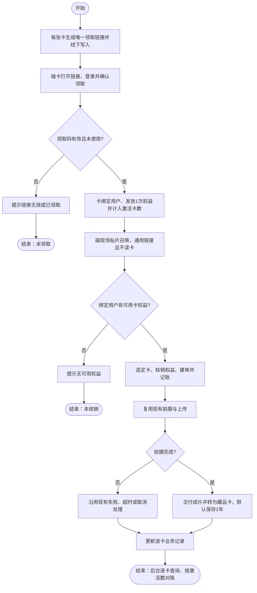

```mermaid
flowchart TD
    Start([开始]) --> S1[每张卡生成唯一领取链接并线下写入]
    S1 --> S2[碰卡打开链接，登录并确认领取]
    S2 --> D1{领取码有效且未使用?}

    D1 -- 否 --> E1[提示链接无效或已领取]
    E1 --> End1([结束：未领取])
    D1 -- 是 --> S3[卡绑定用户、发放1次权益并计入激活卡数]
    S3 --> S4[碰现场贴片召唤，通用链接且不读卡]
    S4 --> D2{绑定用户有可用卡权益?}

    D2 -- 否 --> E2[提示无可用权益]
    E2 --> End2([结束：未核销])
    D2 -- 是 --> S5[选定卡，核销权益、建单并记账]
    S5 --> S6[复用现有拍摄与上传]
    S6 --> D3{拍摄完成?}

    D3 -- 否 --> S7[沿用现有失败、超时或取消处理]
    D3 -- 是 --> S8[交付成片并转为藏品卡，默认保存1年]
    S7 --> S9[更新逐卡业务记录]
    S8 --> S9
    S9 --> End3([结束：后台逐卡查询、按激活数对账])
```
