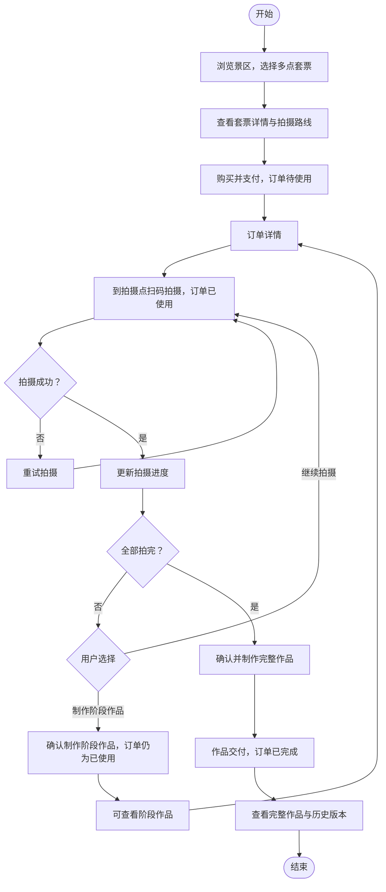

```mermaid
flowchart TD
    Start([开始]) --> S1[浏览景区，选择多点套票]
    S1 --> S2[查看套票详情与拍摄路线]
    S2 --> S3[购买并支付，订单待使用]
    S3 --> S4[订单详情]
    S4 --> S5[到拍摄点扫码拍摄，订单已使用]
    S5 --> D1{拍摄成功？}
    D1 -- 否 --> S6[重试拍摄]
    S6 --> S5
    D1 -- 是 --> S7[更新拍摄进度]
    S7 --> D2{全部拍完？}
    D2 -- 否 --> D3{用户选择}
    D3 -- 继续拍摄 --> S5
    D3 -- 制作阶段作品 --> S8[确认制作阶段作品，订单仍为已使用]
    S8 --> S9[可查看阶段作品]
    S9 --> S4
    D2 -- 是 --> S10[确认并制作完整作品]
    S10 --> S11[作品交付，订单已完成]
    S11 --> S12[查看完整作品与历史版本]
    S12 --> End([结束])
```
